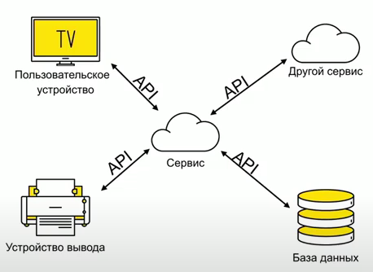
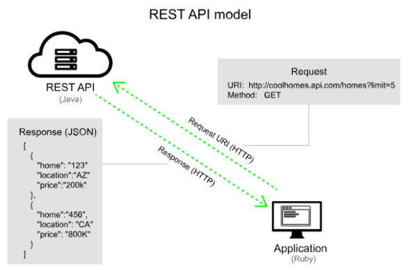
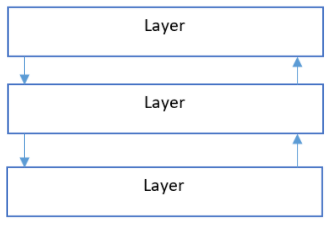

### REST

**API** (Application Programming Interface / программный интерфейс приложения) - набор ф-ций, которые предоставляет сервис в виде публичного интерфейса, с помощью которого происходит взаимодействие между клиентом и сервером.   

**REST** (REpresentational State Transfer / передача состояния представления) - набор правил, который позволяет унифицировать взаимодействие клиентских и серверных приложений.

**RESTfull API** - API, построенные с учётом REST правил.

REST не является стандартом сам по себе, а RESTful-реализации используют такие стандарты, как HTTP, URL, JSON, XML.

REST API не зависит от языка и обрабатывает входящую и исходящую информацию по HTTP:

---

### 6 правил для создания REST-приложений

Действуя в рамках этих правил, система приобретает такие свойства как - производительность, масштабируемость, простоту, способность к изменениям, переносимость, отслеживаемость и надёжность.

Если приложение нарушает любое из этих правил, данную систему нельзя считать REST-системой.

1. **Client-Server / Клиент-Сервер** - система должна быть разделена на независимые части - клиент и сервер, что даст следующие преимущества:   
- независимая разработка клиента и сервера
- удобная переносимость клиента на другие платформы
- возможность масштабируемости сервера
  
2. **Stateless / Отсутствие состояния** - сервер не должен хранить информацию о клиенте. Запрос должен содержать всю необходимую информацию для обработки запроса и, если необходимо, идентификации клиента. Преимущества:
- сервер обрабатывает запросы независимо друг от друга
- архитектура сервера упрощается;

3. **Cache / Кэширование** - для сокращения запросов к БД и увеличения быстродействия REST сервисов рекомендуется применить механизм кэширования.   

Кэшированием можно управлять используя следующие HTTP заголовки:
- Date – дата и время создания ресурса
- Last Modified – дата и время последнего изменения ресурса на сервере
- Cache-Control – заголовок HTTP 1.1 используемый для управления кэшированием
- Age – время, прошедшее с момента последнего получения ресурса

Рекомендации по кэшированию:
- Рекомендуется кэшировать статические ресурсы, такие как изображения, стили css, файлы javascript
- Не рекомендуется указывать большое время жизни кэша
- Динамическое содержимое должно кэшироваться на короткое время или не кэшироваться вообще

4. **Layered system / Многоcлойная система** - система может быть многослойной, но с условием, что каждый слой может видеть только непосредственно следующий слой. Например, если клиент вызывает службу PayPal, а служба PayPal в свою очередь вызывает службу Visa, то клиент о вызове службы Visa ничего не должен знать:      

5. **Code on demand / Код по мере необходимости (необязательное правило)** - в REST возможна загрузка и выполнение кода на стороне клиента. Серверы могут временно расширять функционал клиента, передавая ему логику, которую он может исполнять. Например, это могут быть скомпилированные Java-апплеты или клиентские скрипты на Javascript.

6. **Uniform Interface / Единообразие интерфейса**
