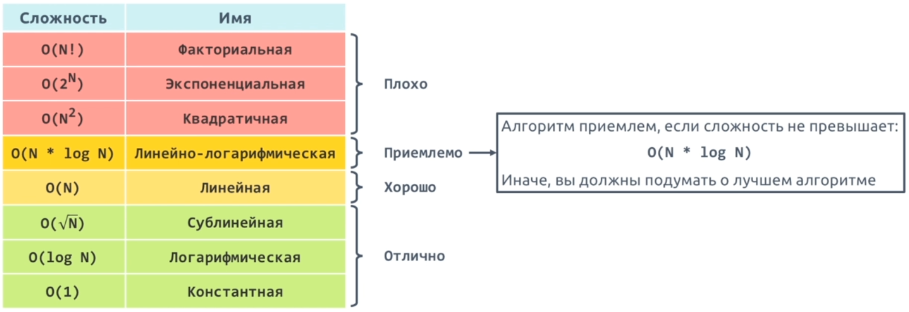
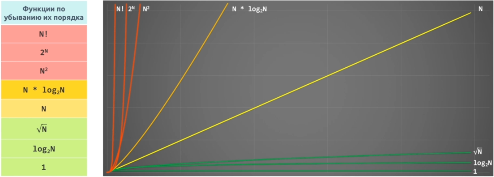
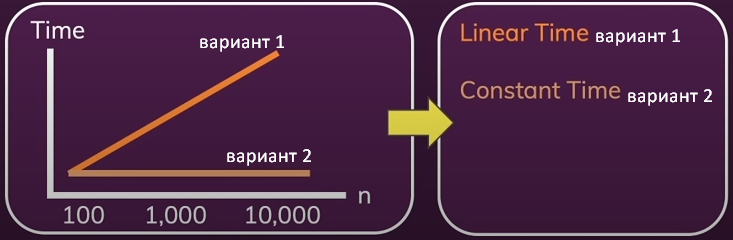

**_Структуры данных и алгоритмы - это материалы для построения программ._**

## Big O нотация

**Алгоритм** - последовательность операций для решения определенной задачи.

При **оценке сложности алгоритмов** учитывают две характеристики:
- оценка по времени - какое количество времени необходимо алгоритму для выполнения операций
- оценка по памяти - какое количество памяти необходимо алгоритму для выполнения операций

Основная характеристика, которую следует учитывать при выборе алгоритма (на языке JS) - это оценка по времени.

Для описания сложности алгоритмов используется **Big O нотация**.    
Её цель - показать, как сильно увеличится количество операций при увеличении количества входящих данных.

Запись сложности алгоритма в 'Big O нотации' выглядит следующим образом - **О()**, например:
- O(1) читается как 'О от единицы' или 'сложность порядка 1' или 'константная сложность'
- O(N) читается как 'О от N' или 'сложность порядка N' или 'линейная сложность'  

**Классификация сложностей алгоритмов**:  





## O(1) - константная сложность

Пример O(1) алгоритма - имеем ф-цию, которая принимает массив и возвращает первый элемент в квадрате:
```js
function getFirstEl(arr) {
	let el = arr[0];
	let elSquared = el * el;
	return elSquared;
}
console.log(getFirstEl([10,15,20])); // 100
```
Независимо от того, какой длины массив будет передан в ф-цию - данный алгоритм постоянно выполняет одинаковое количество операций, никак не увеличивая и не уменьшая расход времени.   
Данный алгоритм всегда выполняется за постоянное время (constant time), которое не зависит от входящих данных.  
Его сложность описывается как **O(1)**.    
O(1) алгоритмы самые эффективные.

**ВАЖНО:**   
Фактически операций в коде выше три, а не одна: 
- Получение первого элемента массива (1 операция - это константная операция)
- Возведение элемента в квадрат (1 операция - это константная операция)
- Возврат значения из функции (1 операция - это константная операция)

Почему тогда сложность описывается как O(1), а не O(3)?  
В Big O нотации кол-во константных операций не важно, так как не зависимо от входящих данных - они всегда выполняются.   
То-есть, при любых входящих данных, данный алгоритм выполняется за постоянное время. Поэтому O(1) - это специальное обозначение константной сложности алгоритма.

## O(N) - линейная сложность

Пример O(N) алгоритма - имеем ф-цию, которая принимает массив и возвращает сумму элементов массива:
```js
function getSum(arr) {
	let sum = 0;
	for(let el of arr){
		sum += el;
	}
	return sum;
}

console.log(getSum([10,15,20])); // 45
```
Здесь происходит перебор всех элементов и чем их больше, тем больше операций, а следовательно, затраченное время зависит от входящих данных и увеличивается линейно (linear time).     
Сложность данного алгоритма описывается как **O(N)**.

**ВАЖНО:**   
Фактически операций в коде выше три, а не одна: 
- Создание переменной let sum = 0 (1 операция - это константная операция)
- Перебор элементов массива в цикле + обновление значения sum внутри цикла (N * 1 операцию)
- Возврат значения из функции (1 операция - это константная операция)

Почему тогда сложность описывается как O(N), а не O(2 + N*1)?   
В Big O нотации кол-во константных операций не важно, так как не зависимо от входящих данных - они всегда будут выполнятся.   
Здесь важно, количество входящих данных N и соответственно время, которое будет затраченно на их обработку.    
Поэтому O(N) - это специальное обозначение линейной сложности алгоритма.

## Правильный выбор алгоритма 

Рассмотрим пример того, почему важно сделать правильный выбор алгоритма.   
Для этого напишем две ф-ции, которые будут решать одинаковую задачу.   
Первая ф-ция имеет O(N)-сложность, вторая O(1).   

*Ф-ция принимает число n и возвращает сумму чисел от 1 до n.*       
*Например, если n = 3, то возвращаемый результат будет равен 6 (1 + 2 + 3)*:
```js
// Метод performance.now() - возвращает временную метку, измеряемую в миллисекундах, с точностью до одной тысячной миллисекунды
const { performance } = require('perf_hooks');

// =================
// Вариант 1 - O(N)
// =================
function sum(n) {
	let res = 0;
	for (let i = 1; i <= n; i++) {
		res += i;
	}
	return res;
}
let start = performance.now();
sum(1000);
let end = performance.now();
console.log(end - start); // 10.397899001836777 

// =================
// Вариант 2 - O(1) 
// =================
function sum2(n) {
	let res = (n / 2) * (1 + n); // Математическая формула
	return res;
}
let start2 = performance.now();
sum2(1000);
let end2 = performance.now();
console.log(end2 - start2); // 1.5142000019550323 
```

Как видно из примера выше, при одинаковых входных параметрах равных 1000, эффективность варианта 2 (*O(1)-сложность*) почти в 10 раз выше, чем варианта 1 (*O(N)-сложность*).   
Если мы изменим входные параметры на 1000.000.000, то результат будет еще более впечетляющим:
- 1581.8106000125408 (вариант 1)
- 1.2152000069618225 (вариант 2)   
 
Как видим, эффективность варианта 2 уже в 1500 раз выше, чем варианта 1. При этом для варианта 2 неважно насколько большое число поступает в ф-цию - его эффективность всегда на одинаковом уровне (**constant**), в то время как эффективность варианта 1 - зависит от величины входного параметра - чем больше число, тем больше итераций цикла, следовательно, затраченное время увеличивается линейно (**linear**):



Следовательно, алгоритм O(1) гораздо эффективнее и он выполняется за «постоянное/константное время».
