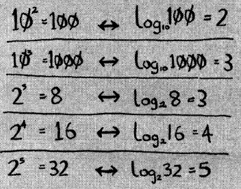

## O(N^2) - квадратичная сложность

Пример O(N^2) алгоритма - имеем ф-цию, которая принимает массив и проверяет его на наличие дублей:
```js
function hasDuplicates(arr) {
	for (let i = 0; i < arr.length; i++) {
		for (let j = i; j < arr.length; j++) {
			if (i !== j && arr[i] === arr[j]) {
				return true;
			}
		}
	}
	return false;
}
```
Ранее было рассмотрено, что перебор элементов массива с помощью цикла - это сложность O(N).    
В данном примере мы имеем вложенный цикл - следовательно, количество операций на каждом элементе массива будет равно количеству элементов массива. То есть, имея лишь массив из пяти элементов [1, 2, 3, 4, 5], мы проделаем 25 операций.     
Сложность данного алгоритма описывается как **O(N^2)**.   

## O(log N) - логарифмическая сложность

Перед тем как приступить к логарифмической сложности, разберемся что такое логарифм.  

**Логарифм** - операция, обратная возведению в степень:



Рассмотрим последний пример из таблицы `log2(32) = 5` - это значит «логарифм по основанию 2 от 32 равен 5». Обратите внимание - «основание 2», т.е. мы мыслим двойками — сколько раз нужно перемножить 2 что бы получить 32.

Когда мы говорим о `log` в рамках Big O нотации - мы всегда подразумеваем `log2`.

---

**Алгоритм со сложностью `O(log N)` говорит - мы делаем столько операций, сколько раз можем разделить массив из N элементов на две части.**   
Например, сколько раз мы можем разделить на две части массив из 4 элементов - 2 раза, а массив из 8 элементов - 3 раза.    
Т.е. кол-во операций равно log2(n) (где n кол-во элементов массива).  

Алгоритм «бинарный поиск» имеет сложность O(log N).   
Бинарный поиск получает отсортированный список и элемент, который необходимо найти в списке. Возвращает позицию искомого элемента, либо null:
```js
function binarySearch(arr, el) {
	// st, end - хранят часть массива, в котором выполняется поиск
	var st = 0;
	var end = arr.length - 1;

	while(st <= end) {
		var mid = Math.floor((st + end) / 2);
		var supposed = arr[mid];
		if (supposed === el) {
			return mid
		} 
		if (supposed < el) {
			st = mid + 1;
		} 
		if (supposed > el) {
			end = mid - 1;
		}
	}
	return null;
}

console.log(binarySearch([10, 20, 30, 40, 50], 20)); // 1
```
