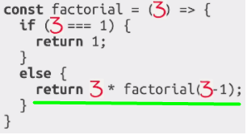
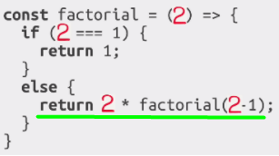
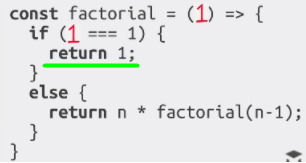
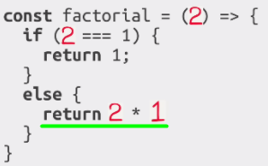
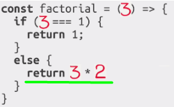

## Рекурсия

**Рекурсия** – это когда функция вызывает сама себя с другими аргументами. Рекурсия должна иметь условие для выхода из рекурсии.

Общее количество рекурсивных вызовов называется *глубиной рекурсии*.    
Значение, на котором рекурсия заканчивается, называют *базисом рекурсии*. 

Рекурсию используют, когда вычисление функции можно свести к её более простому вызову, а его – ещё к более простому, и так далее.

---

На примере вычисления факториала рассмотрим шаги рекурсии.

```js
// 3! = 3 * 2 * 1 = 6

function factorial(n) {
	if (n === 1) return 1; // условие выхода из рекурсии
	return n * factorial(n - 1);
}
console.log(factorial(3));
```

ВЫЗОВ-1: ф-ция принимает число 3, срабатывает блок else, внутри которого мы умножаем 3 на результат вызова ф-ции factorial(3 - 1). Операция умножения сейчас не выполняется, так как мы находимся в состоянии ожидания результата от factorial(3 - 1):    


ВЫЗОВ-2: ф-ция принимает число 2, срабатывает блок else, внутри которого мы умножаем 2 на результат вызова ф-ции factorial(2 - 1). Операция умножения сейчас не выполняется, так как мы находимся в состоянии ожидания результата от factorial(2 - 1):   


ВЫЗОВ-3: ф-ция принимает число 1, срабатывает блок if, внутри которого мы возвращаем число 1 в ВЫЗОВ-2:   


ВЫЗОВ-2: ф-ция принимает число 1, происходит операция умножения 2*1, результат которой мы возвращаем в ВЫЗОВ-1:   


ВЫЗОВ-1: ф-ция принимает число 2, происходит операция умножения 3*2, результат которой мы возвращаем из ф-ции:    


## Контекст выполнения, стек

Информация о процессе выполнения запущенной функции хранится в её **контексте выполнения** (execution context).

**Контекст выполнения** – специальная внутренняя структура данных, которая содержит информацию о вызове функции. Она включает в себя конкретное место в коде, на котором находится интерпретатор, локальные переменные функции, значение this и прочую служебную информацию.

Один вызов функции имеет ровно один контекст выполнения, связанный с ним.

**Стек выполнения (execution stack) или стек вызовов (call stack)** - это *Last In - First Out стек*, который используется для хранения контекстов выполнения, создаваемых в ходе работы кода.

*Когда функция производит рекурсивный вызов, происходит следующее:*   
* Выполнение текущей функции приостанавливается.
* Контекст выполнения, связанный с ней, запоминается в стеке контекстов выполнения.
* Выполняются вложенные вызовы, для каждого из которых создаётся свой контекст выполнения, которые также запоминаются в стеке.
* Далее происходит обработка вызовов в обратном порядке - самый последний вызов, добавленный в стек, обрабатывается первым, а первый - последним.

Детальнее см. [Контекст выполнения, стек](https://github.com/alex-31g/rxjs-lessons/blob/a1bfa71334a38ccb8bc23480ea948e28c0bae5b4/!_lessons/basic-rxjs-info/01.%20%D0%9F%D0%B0%D1%80%D0%B0%D0%BB%D0%B5%D0%BB%D1%8C%D0%BD%D1%8B%D0%B5%20%D0%B2%D1%8B%D1%87%D0%B8%D1%81%D0%BB%D0%B5%D0%BD%D0%B8%D1%8F.md)
