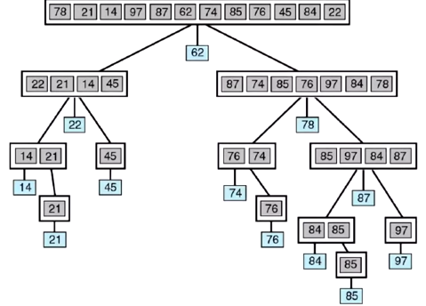
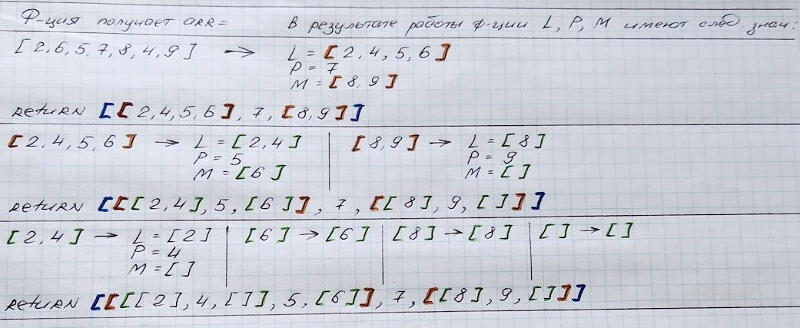

**Быстрая сортировка (Quicksort)** - один из самых эфективных алгоритмов сортировки последовательности данных.

АЛГОРИТМ:
1) выбираем опорный элемент **pivot** - это центральный элемент массива. 
2) элементы, значение которых меньше чем опора - перемещаются в массив **less**, а больше - в массив **more**.
3) процесс п. 1 и 2 повторяется рекурсивно для массивов less и more до тех пор, *пока длина массива не станет равна 1*.

**Временная сложность - O(N * log N)**



## Быстрая сортировка с помощью цикла

```js
const arr = [ 2, 6, 5, 7, 8, 4, 9 ];
let count = 0;

function quickSort(arr) {
	if (arr.length <= 1) {
		return arr;
	}

	let pivotIndx = Math.floor(arr.length / 2);
	let pivot = arr[pivotIndx];

	let less = [];
	let more = [];

	for (let i = 0; i < arr.length; i++) {
		count++;
		if (i === pivotIndx) {
			continue;
		}
		if (arr[i] < pivot) {
			less.push(arr[i]);
		} else {
			more.push(arr[i]);
		}
	}

	return [...quickSort(less), pivot, ...quickSort(more)];
}

console.log(quickSort(arr));
```

Чтобы понять как работает код выше, заменим строку 
```js 
return [...quickSort(less), pivot, ...quickSort(more)]; 
```
на
```js 
return [quickSort(less), pivot, quickSort(more)]; 
```
и взглянем, как отрабатывает ф-ция quickSort при каждом вызове:    


## Быстрая сортировка с помощью рекурсии