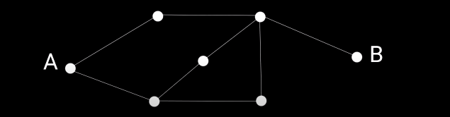
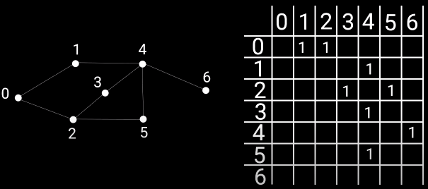
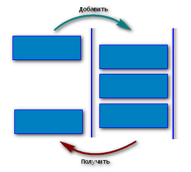
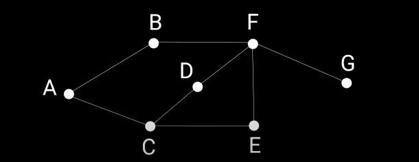

# Поиск в ширину, Графы

## Граф

В алгоритме поиска в ширину будет использоваться структура данных - Граф.

**Граф** – структура данных, элементы которой представляют из себя совокупность точек, соединенных линиями. Точки называются **вершинами**, а линии – **ребрами**.  

Ребра бывают **однонаправленные** и **двунаправленные**:   
- двунаправленные ребра - когда из вершины А можно попасть в В, а из В в А; 
- однонаправленные - когда из А можно попасть только в В



Графы могут быть представленны в виде матрицы, где столбцы и строки - это вершины, и если путь из одной вершину в другую есть, то на их перехрестьи ставится единица, если нет - ноль:



```js
const matrix = [
	[0,1,1,0,0,0,0],
	[0,0,0,0,1,0,0],
	[0,0,0,1,0,1,0],
	[0,0,0,0,1,0,0],
	[0,0,0,0,0,0,1],
	[0,0,0,0,1,0,0],
	[0,0,0,0,0,0,0],
]
```

## Очередь

В алгоритме поиска в ширину будет использоваться структура данных - Очередь.

**Очередь** — структура данных, элементы которой добавляют и извлекают по принципу «первый вошел, первый вышел» (First In - First Out (FIFO)).

```js
var queue = [];
queue.push(2);         // [2]
queue.push(5);         // [2, 5]
var i = queue.shift(); // [5]
alert(i);              // 2
```



## Поиск в ширину

**Поиск в ширину** - алгоритм поиска кратчайшего пути из одной вершины графа к другой. Под кратчайшим путем подразумевается путь, содержащий наименьшее число ребер.

ЗАДАЧА:
Создать ф-цию, с помощью которой можно определить - существует ли путь из вершины А в вершину G. Ребра графа - однонаправленные.



Путь из вершины А в вершину G может быть определен следующими шагами:   
- 4 шага: AC - CD - DF - FG
- 4 шага: AC - CE - EF - FG  
- 3 шага: AB - BF - FG (кратчайший путь) 

РЕАЛИЗАЦИЯ:    
```js
// Представить граф в коде можно в виде объекта, свойства которого это вершины графа, 
// и каждая вершина содержит массив тех вершин, к которой у неё есть путь: 
const graph = {};
graph.a = ['b', 'c'];
graph.b = ['f'];
graph.c = ['d', 'e'];
graph.d = ['f'];
graph.e = ['f'];
graph.f = ['g'];

// Ф-ция принимает:
// - объект графа
// - стартовую вершину
// - конечную вершину
function breadthSearch(graph, start, end) {
	let queue = [];
	queue.push(start);

	while (queue.length > 0) {
		const current = queue.shift();

		if (!graph[current]) {
			return false;
		}
		// includes() определяет, содержит ли массив определённый элемент, 
		// возвращая в зависимости от этого true или false
		if (graph[current].includes(end)) {
			return true;
		} else {
			queue = [...queue, ...graph[current]];
		}
	}
	return false;
}

console.log(breadthSearch(graph, 'a', 'g'))
```

АЛГОРИТМ:
- определяем граф в виде объекта:
	- имена ключей объекта - это вершины графа 
	- значения ключей объекта - содержат массив вершин, к которым у текущей вершины есть доступ
- ф-ция/алгоритм принимает - объект графа, стартовую и конечную вершины (start, end)
- внутри ф-ции создаем пустую очередь queue
- помещаем start в queue (метод push)
- внутри цикла `while (queue.length > 0)`:
	- извлекаем из queue вершину (метод shift) и помечаем её как current 
	- если current не существует в графе - возвращаем false
	- если current существует в графе и содержит end (метод includes) - возвращаем true  
	- если current существует в графе и не содержит end - присваиваем в queue = [...queue, ...graph[current]];  
