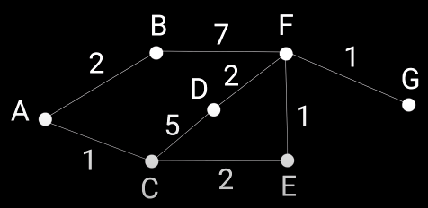
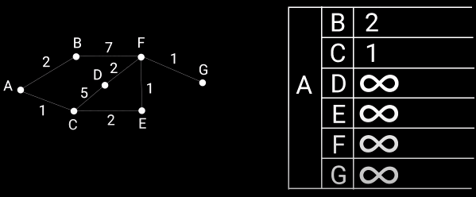
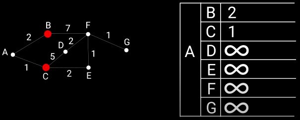
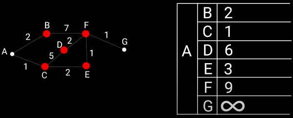
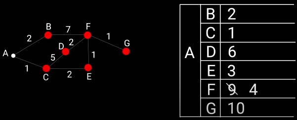
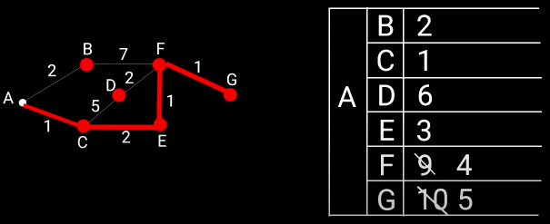

**Алгоритм Дейкстры** - алгоритм поиска кратчайшего пути из одной вершины графа к другой. Под кратчайшим путем подразумевается путь, сумарная длина ребер которого будет наименьшей.

Отличие *Алгоритма Дейкстры* от *Алгоритма поиска в ширину* легко увидеть при решении задачи поиска кратчайшего пути из вершины А в G:



- **Алгоритм Дейкстры**: 4 шага AC - CE - EF - FG, **вес = 5**
- **Алгоритма поиска в ширину**: 3 шага AB - BF - FG, **вес = 10** 

## Логика работы Алгоритма Дейкстры

**ЗАДАЧА:**
Создать ф-цию, с помощью которой можно определить кратчайший путь из вершины А в вершину G. Ребра графа - однонаправленные.

**ЛОГИКА:**
- этап 1:
	- за стартовую вершину принимаем А, за конечную вершину - G
	- составляем таблицу, в которую записываем значение тех вершин, к которым можно попасть из стартовой точки - это B и C
	- остальные вершины являются недостижимыми и помечаем их знаком бесконечности

		

- этап 2:
	- помечаем вершины B и C - как рассмотренные

		

	- рассматриваем вершины, к которым можно попасть из вершин B и C - это D, E, F; записываем в таблицу значения от точки А до точек D, E, F

		

- этап 3:
	- рассматриваем вершины, к которым можно попасть из вершин D, E, F - это G, F; записываем в таблицу значения от точки А до точек G, F.    
		Мы уже достигли точку F на предыдущем этапе, тогда путь к ней мы записали равный 9. На данном этапе мы достигли F за более короткий путь - 4, поэтому перезаписываем значение в таблице

		
	
- этап 4:
	- рассматриваем вершины, к которым можно попасть из вершин G, F - это G; записываем в таблицу значения от точки А до точки G.   
		Мы уже достигли точку G на предыдущем этапе, тогда путь к ней мы записали равный 10. На данном этапе мы достигли G за более короткий путь - 5, поэтому перезаписываем значение в таблице.   
		В итоге мы достигли точку G проделав путь в 5 единиц

		

**РЕАЛИЗАЦИЯ:**    
```js
// Представить граф в коде можно в виде объекта, свойства которого это вершины графа, 
// и каждая вершина содержит объект тех вершин и расстояний, к которой у неё есть путь: 
const graph = {};
graph.a = {b: 2, c: 1};
graph.b = {f: 7};
graph.c = {d: 5, e: 2};
graph.d = {f: 2};
graph.e = {f: 1};
graph.f = {g: 1};
graph.g = {};

// Ф-ция принимает:
// - объект графа
// - стартовую вершину
// - конечную вершину
function shortPath(graph, start, end) {
	// costs - объект-таблица, которая хранит вершины и кратчайшие пути в виде:
	// { b: 2, c: 1, d: 6, e: 3, f: 4, g: 5 }
	const costs = {};

	// processed - содержит вершины, которые уже проверили
	const processed = [];

	// neighbors - соседние вершины рассматриваемого узла
	let neighbors = {};

	// [Этап 1]:
	// - заполняем таблицу costs, в которую записываем значение тех вершин, к которым можно попасть из стартовой точки А - это B и C
	// - остальные вершины, к которым нельзя добраться из стартовой точки А - заполняем большим числом
	// Object.keys() - возвращает массив ключей объекта
	Object.keys(graph).forEach(node => {
		// Стартовая вершина в таблицу не добавляется
		if (node !== start) {
			// Получаем значение graph.a.b и graph.a.c
			let value = graph[start][node];

			// Добавляем значение b и c в таблицу кратчайших путей
			costs[node] = value || 100000000;
		}
	});

	console.log(costs); // { b: 2, c: 1, d: 100000000, e: 100000000, f: 100000000, g: 100000000 } 

	// Поиск вершины, в которую мы можем попасть из точки А и путь к которой самый короткий
	let node = findNodeLowestCost(costs, processed); // 'c'

	// Комментарии внутри цикла относятся к первой итерации
	while (node) {
		const cost = costs[node]; // 1
		neighbors = graph[node]; // {d: 5, e: 2};

		// Object.keys() - возвращает массив ключей объекта
		Object.keys(neighbors).forEach(neighbor => {
				let newCost = cost + neighbors[neighbor]; // 1+5=6
				if (newCost < costs[neighbor]) { // 6 < 100000000
					costs[neighbor] = newCost; // costs[d]=6
				}
		})
		processed.push(node);

		// costs = { b: 2, c: 1, d: 6, e: 100000000, f: 100000000, g: 100000000 }
		// processed = ['c']
		node = findNodeLowestCost(costs, processed); // 'b'
	}

	return costs; // { b: 2, c: 1, d: 6, e: 3, f: 4, g: 5 } 
}

// Поиск вершины, в которую мы можем попасть из точки, и путь к которой самый короткий
// costs - объект-таблица, которая хранит кратчайшие пути: { b: 2, c: 1, d: 100000000, e: 100000000, f: 100000000, g: 100000000 } 
// processed - массив, который хранит вершины, которые уже проверили: []
function findNodeLowestCost(costs, processed) {
	// lowestCost - минимальное значение пути (по умолчанию - большое число)
	let lowestCost = 100000000;

	// lowestNode - искомая вершина
	let lowestNode;

	// Object.keys() - возвращает массив ключей объекта
	Object.keys(costs).forEach(node => {
		let cost = costs[node];
		if (cost < lowestCost && !processed.includes(node)) {
			lowestCost = cost;
			lowestNode = node;
		}
	});
	 
	return lowestNode;
}

console.log(shortPath(graph, 'a', 'g'));
```