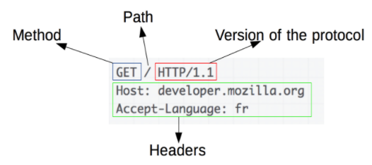
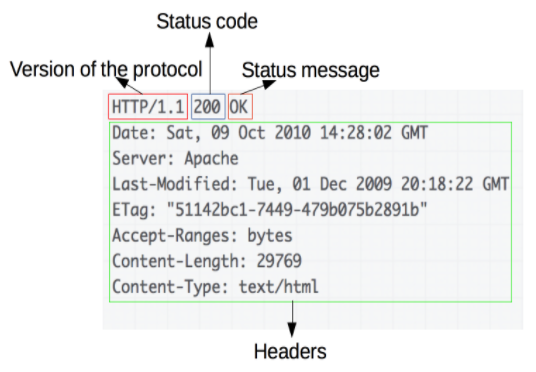
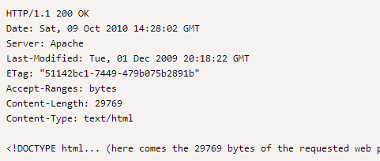

### HTTP

**HTTP** (HyperText Transfer Protocol / протокол передачи гипертекста) — сетевой протокол для транспорта данных, изначально в виде гипертекстовых документов в формате HTML, а в настоящее время используется для передачи произвольных данных - изображения, видео и т.д. 

**Сетевой протокол** - набор правил, которые позволяют двум компьютерам обмениваться данными.

Основой HTTP является технология **клиент-сервер** - клиент открывает соединение и посылает запрос к серверу, сервер возвращает обработанный результат.

Помимо обмена данными между клиентом и сервером, HTTP используется в качестве «транспорта» для других протоколов - SOAP, XML-RPC, WebDAV.

---

### HTTPS

**HTTPS** (HyperText Transfer Protocol Secure / безопасный протокол передачи гипертекста) — это расширение протокола HTTP, которое поддерживает шифрование посредством криптографических протоколов SSL и TLS.

**Отличие HTTP от HTTPS**:
- HTTPS не является отдельным протоколом передачи данных, а представляет собой расширение протокола HTTP с надстройкой шифрования
- передаваемые по протоколу HTTP данные не защищены, HTTPS обеспечивает конфиденциальность информации путем ее шифрования
- HTTP использует порт 80, HTTPS — порт 443

---

### HTTP сообщения

Существует два типа HTTP сообщений - запросы и ответы.

**Запросы** состоят из: 
- Стартовая строка — `<Метод> <URI> HTTP/<Версия>`
- Заголовки
- Тело сообщения

Тело сообщения может отсутствовать, но стартовая строка и заголовок являются обязательными элементами.    

Пример:    

**Ответы** состоят из:
- Стартовая строка — `HTTP/<Версия> <Status-code> <Status-msg>`
- Заголовки
- Тело сообщения

Пример:    

---

### HTTP методы

**HTTP методы** — указывают, какое желаемое действие выполнится для данного ресурса. 

Основные методы:
- GET - получить
- POST - создать
- PUT - изменить полностью
- PATCH - изменить частично
- DELETE - удалить

---

### Код состояния HTTP

Код состояния HTTP — часть первой строки ответа сервера при запросах по протоколу HTTP. Он представляет собой целое число из трёх десятичных цифр. Первая цифра указывает на класс состояния. 

Есть пять классов кодов состояния:
- 1xx: Informational (информационные)
- 2xx: Success (успешно)
- 3xx: Redirection (перенаправление)
- 4xx: Client Error (ошибка клиента)
- 5xx: Server Error (ошибка сервера)
